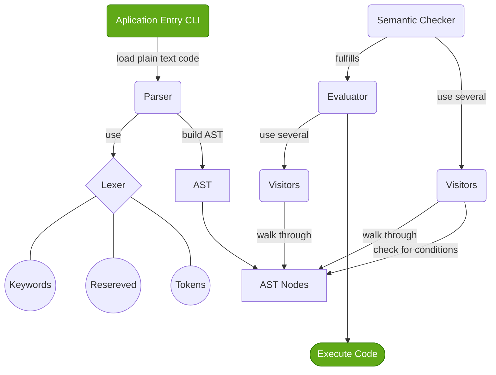

# Text Parser DSL
## Autores
- Deborah Famadas Rogríguez - C312
- Erick Fonseca Pérez - C312
- Gabriel Hernández Rodríguez - C311

## Indice
- [Text Parser DSL](#text-parser-dsl)
  - [Autores](#autores)
  - [Indice](#indice)
  - [Desarrollo](#desarrollo)
    - [1. Descripcion General del Problema acercamiento a la solucion:](#1-descripcion-general-del-problema-acercamiento-a-la-solucion)
  - [2. Propuesta de diseño del lenguaje:](#2-propuesta-de-diseño-del-lenguaje)
      - [Sintaxis:](#sintaxis)
      - [Tipos Nativos:](#tipos-nativos)
      - [Control de Flujo:](#control-de-flujo)
      - [Ejemplos:](#ejemplos)
  - [3. Estructura General de DSL](#3-estructura-general-de-dsl)
      - [Arquitectura](#arquitectura)
  - [4. Gramatica](#4-gramatica)

## Desarrollo
### 1. Descripcion General del Problema acercamiento a la solucion:
Alguna vez has querido manejar un texto de forma facil, con oraciones, parrafos, palabras divididas de forma nativa, relizar operaciones de cambiar y leer un texto de forma facil y rapida sin necesidad de importar mil librerias ni crear una estructura compleja de clases? Pues nosotros tambien. Nuestra propuesta es un DSL que permita manejar de forma facil el texto, recorrerlo, manipularlo, ...etc.

## 2. Propuesta de diseño del lenguaje:
#### Sintaxis:
- Se propone utilizar una sintaxis parecida a otros lenguajes como SQL, con palabras reservadas escritas con mayusculas como `SELECT`, `GREP`, ...etc. 
- Las instrucciones sucesivas en el codigo estaran separadas por el caracter `;` 
- Los distintos scopes encerrados entre `{}`
- Los argumentos de funciones y palabras reservadas por el lenguajes estaran encerrados entre parentesis `()`
- Los elementos en iterables se agrupan por comas `,`. 
- Los literales estaran encerrados entre comillas dobles `""`. 
- Las instrucciones de I/O se manejan con una sitaxis similar a *C++* `>>` y `<<`

#### Tipos Nativos:
- `STRING`: guarda literales
- `WORD`: guarda palabras como elementos sitacticos (sin espacios intermedios ni caracteres especiales)
- `SENTENCE`: conjunto de palabras y signos de puntacion debiles que es analizable sintacticamente
- `PARRAGRAPH`: Conjunto de oraciones sin caracteres especiales como `\n` *(new line)*.
- `DOCUMENT`: cualquier literal que nativamente puede ser dividido en parrafos.
- `INT`: numeros enteros.
- `FLOAT`: numeros racionales.
- `BOOL`: booleanos con literales `true` o `false`.
- Array like objects: inicializados como `TYPE[]`.

#### Control de Flujo:
- `FOR`,`FOREACH` y `WHILE` como ciclos con `BREAK` y `CONTINUE`.
- `IF`, `ELSE`: condicionales
- `|`, `&`: bitwise operations

#### Ejemplos:

```c#
int[][] functi (int a,int b) { 
    5+6; 
};

foreach v in values {
    string vaca = "vaca muu";
    vaca = st = 34 / 2;
    return 6;
}; 

while(true) {
    if false | true {
        break;
    } else {
        if (false) {
            continue;
        };
    };
};
```

## 3. Estructura General de DSL
#### Arquitectura



## 4. Gramatica
Para los propositos de la creacion de este DSL se ha decidido utilizar un parser LALR, puesto que la libreria `ply` tiene `yacc` (yet another compiler compiler).

Un parser LALR (Look-Ahead Left-to-Right) es un tipo de analizador sintáctico automático utilizado en la implementación de compiladores para analizar entrada y verificar si cumple con la gramática de un lenguaje de programación. Los parsers LALR utilizan una tabla de análisis sintáctico para realizar el análisis y se basan en el algoritmo de predicción de símbolos canónicos, que utiliza información de la entrada y de la gramática del lenguaje para predecir cómo debe continuar el análisis.

Una de las ventajas de los parsers LALR es que son más fáciles de implementar que los parsers LR (Left-to-Right) completos, ya que utilizan una cantidad menor de estados en su tabla de análisis sintáctico. Además, los parsers LALR tienen un tiempo de ejecución más rápido y requieren menos memoria que los parsers LR completos. Otro beneficio es que los parsers LALR son capaces de manejar gramáticas más complejas que los parsers LR simples. Sin embargo, una desventaja de los parsers LALR es que pueden tener problemas con gramáticas que son ambiguas o que tienen conflictos de SHIFT/REDUCE.

Teniendo esto en cuenta la misma libreria `ply` escanea las reglas de la gramatica en busca de dichos conflictos. 

Cada una de las reglas de la gramatica se encuentra escrita de forma explicita en cada una de las funciones de las `parser_units`